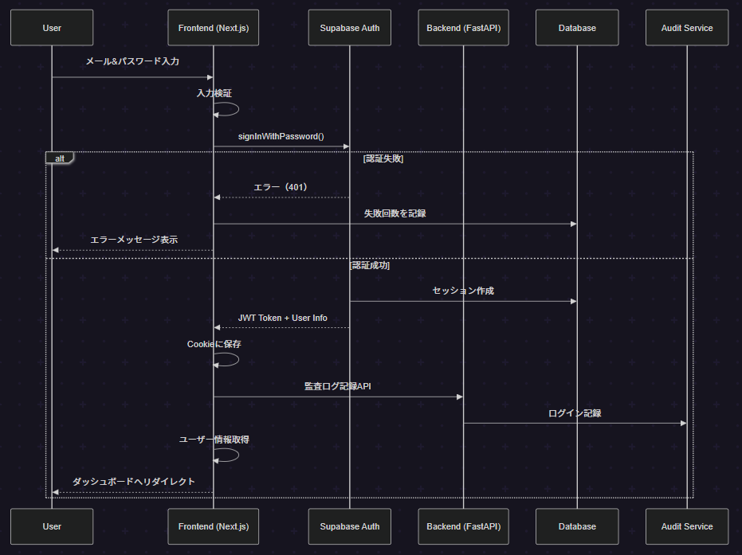
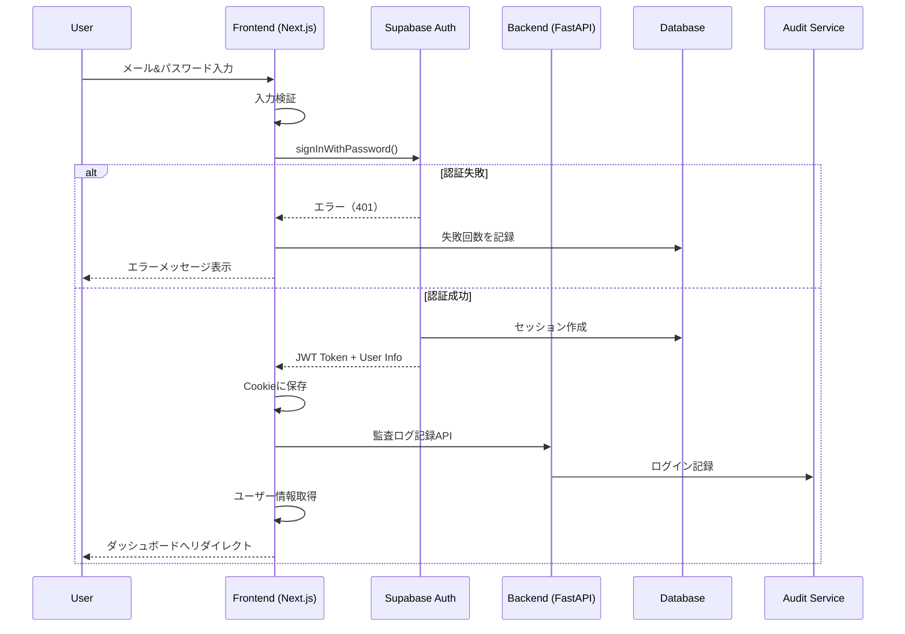
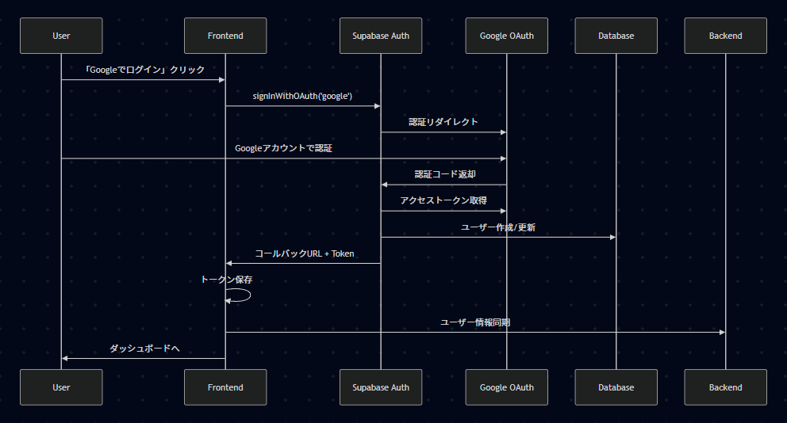
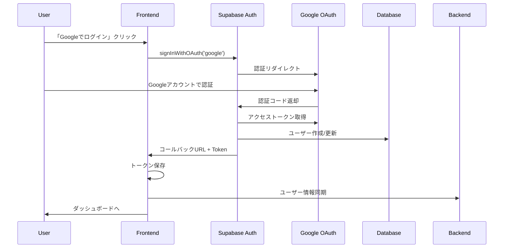
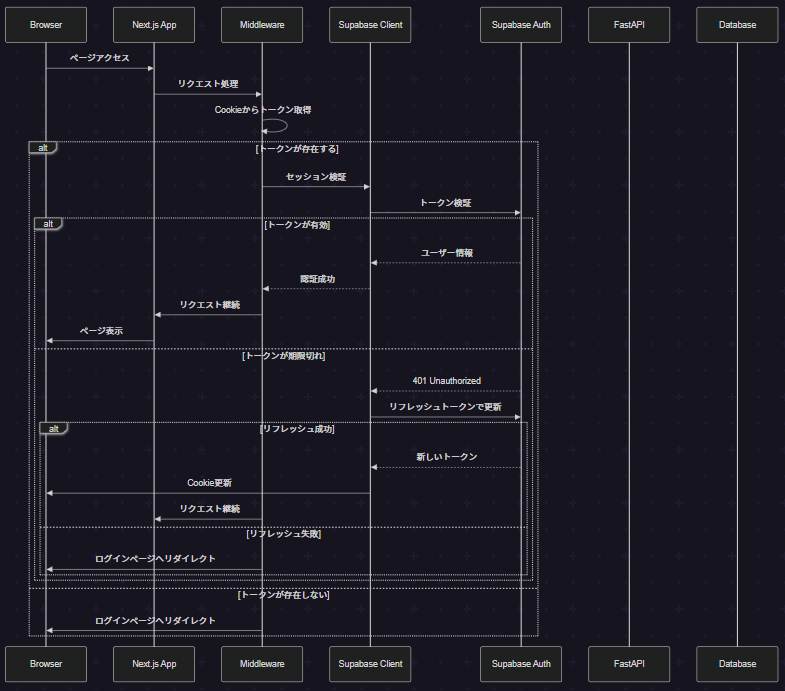
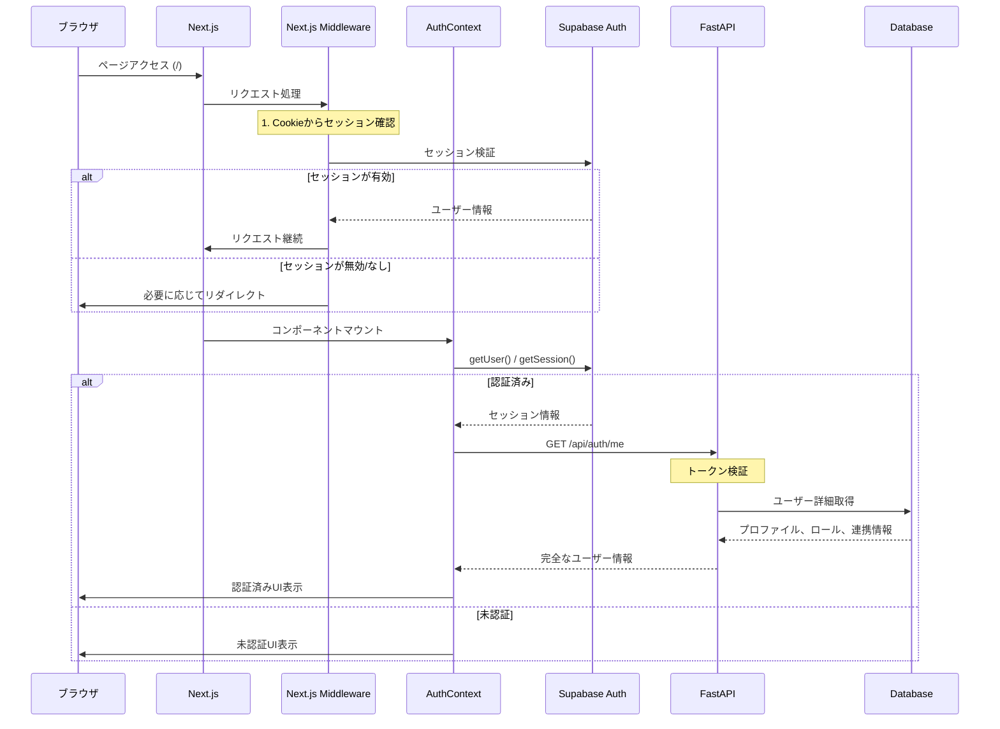

# SSO・メール認証システム設計書

## アーキテクチャ概要

```
┌─────────────┐     ┌──────────────┐     ┌─────────────┐     ┌─────────────┐
│   Next.js   │────▶│   FastAPI    │────▶│  Supabase   │     │   Stripe    │
│  (Frontend) │     │  (Backend)   │     │    Auth     │     │   Webhook   │
└─────────────┘     └──────────────┘     └─────────────┘     └─────────────┘
       │                    │                     │                    │
       ▼                    ▼                     ▼                    ▼
┌─────────────┐     ┌──────────────┐     ┌─────────────┐     ┌─────────────┐
│   Cookie    │     │     JWT      │     │ PostgreSQL  │     │   Stripe    │
│   Session   │     │  Validation  │     │  Database   │     │     API     │
└─────────────┘     └──────────────┘     └─────────────┘     └─────────────┘
```

## 1. 認証の責任範囲
- **Next.js**: 認証, ロールベースでUIの表示制御(認可)
- **FastAPI**: 認証の検証, ロールベースでAPIのアクセス制御(認可)
- **Supabase Auth**: ユーザー管理, 認証トークンの発行

## 2. セキュリティ要件

### 2.1 認証・認可
- **PKCE (Proof Key for Code Exchange)** を使用したOAuth 2.0フロー
- **セッション管理**: HTTPOnly Cookieでセッション管理
- **CSRF対策**: SameSite=Strict Cookie + CSRFトークン
- **XSS対策**: Content Security Policy (CSP) の実装

### 2.2 パスワード要件
- 最小8文字以上
- 大文字・小文字・数字を含む
- 過去5回のパスワードの再利用禁止
- パスワード強度メーター表示

## 3. フロー

### 3.1 ユーザー登録（Email & パスワード）





### 3.2 ユーザー登録（SSO）





### 3.3 ログイン中



