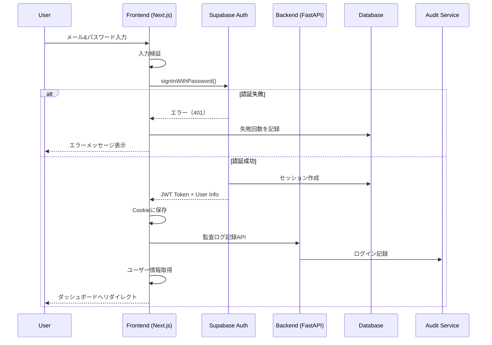
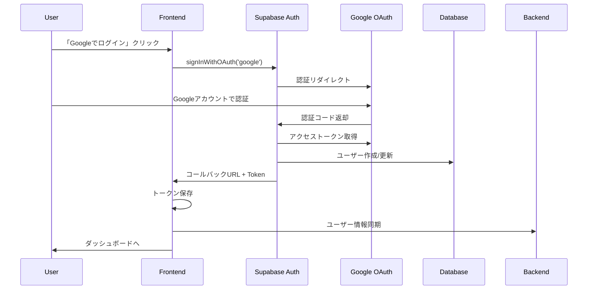
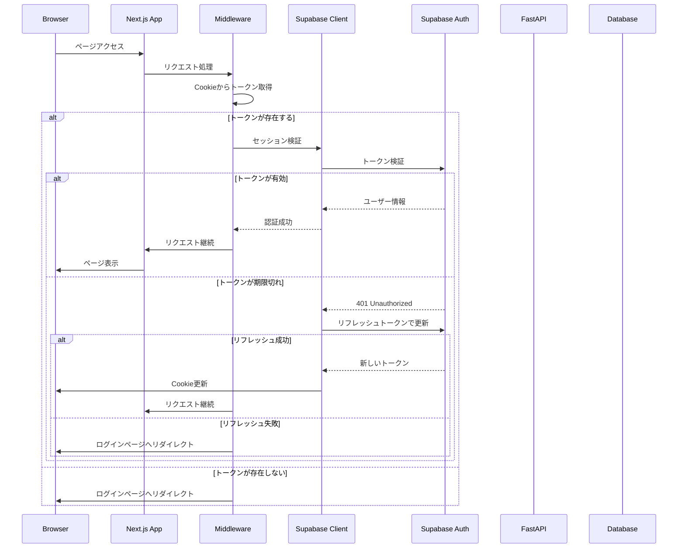

# SSO・メール認証システム設計書

## アーキテクチャ概要

```

```

## 1. セキュリティ要件

### 1.1 認証・認可
- **PKCE (Proof Key for Code Exchange)** を使用したOAuth 2.0フロー
- **セッション管理**: HTTPOnly Cookieでセッション管理
- **CSRF対策**: SameSite=Strict Cookie + CSRFトークン
- **XSS対策**: Content Security Policy (CSP) の実装

### 1.2 パスワード要件
- 最小8文字以上
- 大文字・小文字・数字を含む
- 過去5回のパスワードの再利用禁止
- パスワード強度メーター表示

## 2. フロー

### 2.1 ユーザー登録（Email & パスワード）




### 2.2 ユーザー登録（SSO）




### 2.3 ログイン中


